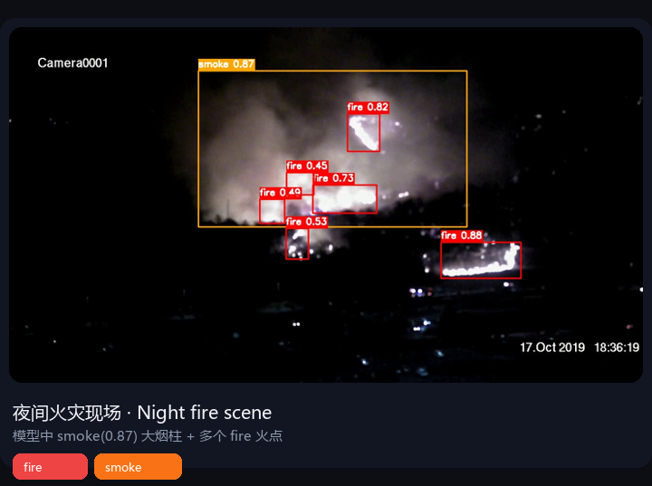
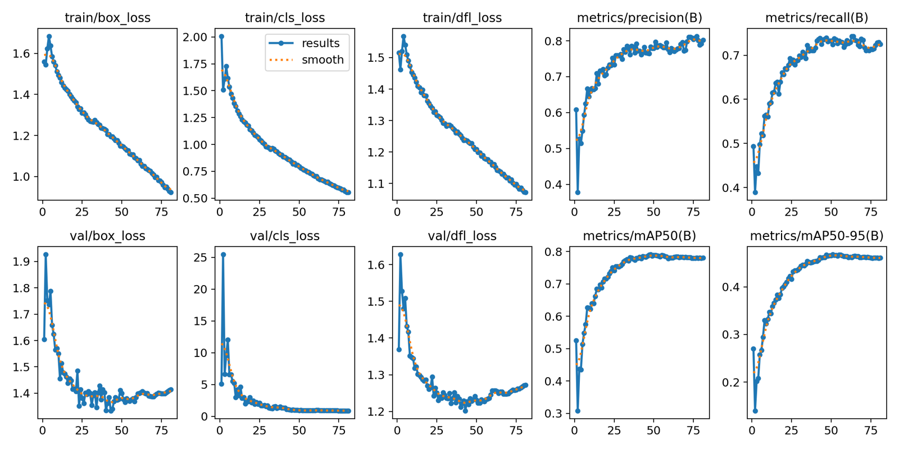
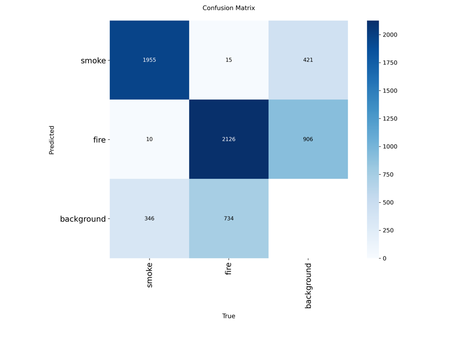
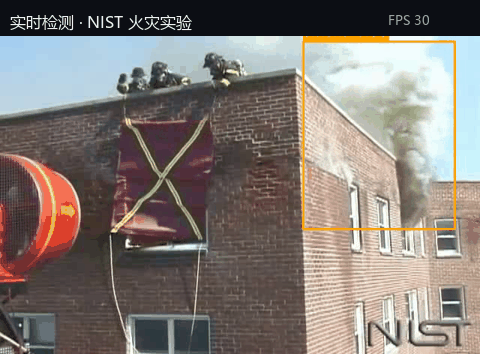
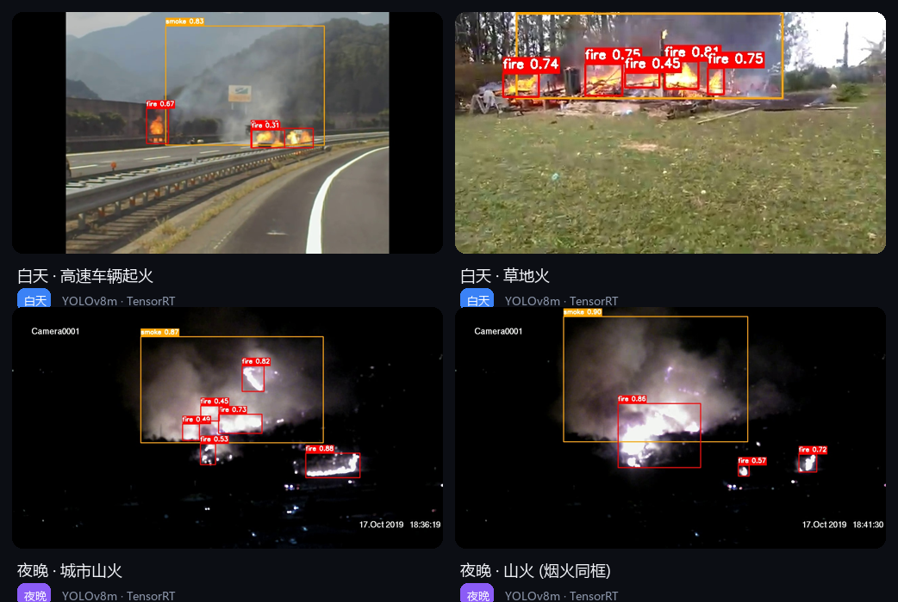
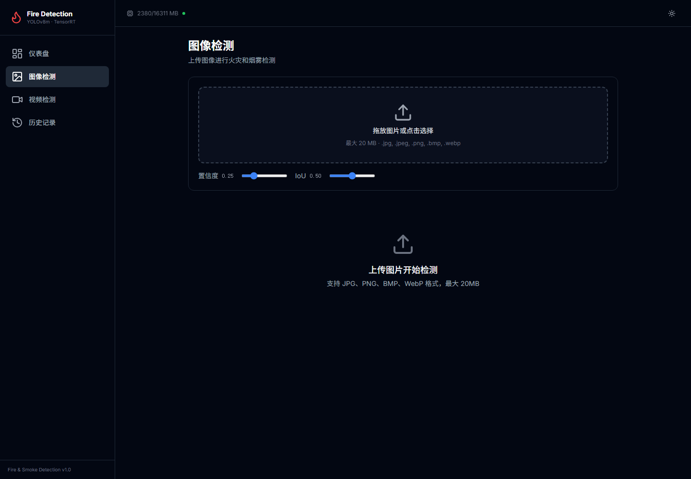

# Fire & Smoke Detection System 🔥💨

基于 **YOLOv8m** 的火灾与烟雾目标检测系统，在 [D-Fire 数据集](https://github.com/gaiasd/DFireDataset)（21,527 张图片 / 26,557 个标注框）上训练，支持**图片、视频两种推理方式，并提供完整的 **FastAPI 后端 + React 前端 Web 应用**，可通过 TensorRT 加速至 241 FPS。

<p align="center">
  
</p>

> <sub>上图：夜间火灾现场。模型同时定位了 `smoke`（0.87）大范围烟柱和多个 `fire` 火点（0.88 / 0.82 / 0.73…）。</sub>

---

## ✨ 功能特性

- **双类目标检测**：同时输出 `fire` / `smoke` 的边界框、类别标签与置信度
- **多模态输入**：单图、图片目录、视频文件
- **可视化**：自动绘制带类别标签和置信度的标注框，支持对比图/网格图
- **TensorRT 加速**：export 到 ONNX/TensorRT，推理加速约 1.8×（4.2 ms → 241 FPS）
- **Web 应用**：FastAPI 异步后端 + React 前端（仪表盘、图片/视频检测、历史记录）
- **历史记录 & 统计**：SQLite 持久化检测记录，仪表盘含趋势图、置信度分布、类别分布

---

## 📊 训练结果

**最佳模型**：`runs/detect/fire_smoke_yolov8m_20260526_2202/weights/best.pt`

<details open>
<summary><b>验证集 (val) 结果</b></summary>

| 指标 | 整体 | smoke | fire |
|:----:|:----:|:-----:|:----:|
| mAP@50 | **0.789** | 0.864 | 0.715 |
| mAP@50-95 | 0.468 | 0.549 | 0.387 |
| Precision | 0.797 | 0.844 | 0.749 |
| Recall | 0.725 | 0.808 | 0.642 |

</details>

<details>
<summary><b>测试集 (test) 结果</b></summary>

| 指标 | 整体 | smoke | fire |
|:----:|:----:|:-----:|:----:|
| mAP@50 | **0.710** | 0.779 | 0.642 |
| Precision | 0.776 | 0.832 | 0.720 |
| Recall | 0.749 | 0.815 | 0.683 |

</details>

### 📉 训练过程可视化

训练损失（box/cls/dfl）随 epoch 收敛，mAP、precision、recall 稳定上升（约 80 epoch，早停）。

<div align="center">
  
</div>

<sub>训练曲线：train/val 损失下降，mAP@50 收敛至 ~0.79。</sub>

### 🧮 混淆矩阵

fire 与 smoke 之间的**分类混淆极小**（smoke→fire 15，fire→smoke 10），主要误差集中在 background（漏检：fire 906 / smoke 421）。

<div align="center">
  
</div>

<sub>混淆矩阵：对角线（正确分类）占绝对主导，类别串扰可忽略。</sub>

### ⚡ 推理性能 (RTX 5060 Ti, imgsz=640)

| 后端 | 精度 | 延迟 | FPS |
|:----|:----:|:----:|:---:|
| PyTorch | FP16 | 7.6 ms | 132 |
| **TensorRT** | **FP16** | **4.2 ms** | **241** |

> TensorRT 相比 PyTorch 加速约 **1.8×**，完全满足实时检测需求（>30 FPS）。

---

## 🔍 检测效果演示

### 视频实时检测（GIF 动图）

<div align="center">
  
</div>
### 多场景检测（夜间火灾 / 白天烟雾）

<div align="center">
  
</div>
---

## 🖥 Web 应用

项目提供完整的 **FastAPI 后端 + React 前端** 应用（`backend/` + `frontend/`），支持可视化检测、历史记录管理和仪表盘统计。

```
+-------------------+       +---------------------+       +----------------+
|   React 前端      |<----->|   FastAPI 后端       |<----->|   SQLite 数据库  |
|   (TypeScript)    |  REST |   (Python)          |  SQL  |                |
+-------------------+  API  +---------------------+       +----------------+
                                   |
                           +-------------------+
                           |   NVIDIA GPU       |
                           |  (RTX 5060 Ti)     |
                           |  TensorRT / PyTorch |
                           +-------------------+
```

- **仪表盘**：统计概览、类别分布、**近 14 天检测趋势图**、置信度分布
- **图片/视频检测**：拖放上传、阈值调节、进度轮询、结果时间线
- **历史记录**：分页、筛选、搜索、删除

<p align="center">
  
</p>

<sub>图片检测页：拖放上传、置信度 / IoU 阈值调节。</sub>

### 启动后端（托管前端 + API）

```bash
conda activate myPytorch
cd backend
python run.py            # http://127.0.0.1:8000
```

前端已预构建在 `frontend/dist/`，由后端直接托管；若要改前端可 `cd frontend && pnpm dev`（开发）或 `pnpm build`（构建）。

---

## 🔧 环境配置

```bash
# 激活 conda 环境
conda activate myPytorch

# 验证 GPU
python -c "import torch; print(torch.cuda.is_available()); print(torch.cuda.get_device_name(0))"
```

| 组件 | 版本/规格 |
|------|-----------|
| Python | 3.9.23 |
| PyTorch | 2.9.0+cu128 |
| Ultralytics | 8.4.39 |
| GPU | NVIDIA GeForce RTX 5060 Ti (16 GB) |

---

## 📚 数据集

[D-Fire Dataset](https://github.com/gaiasd/DFireDataset) — 21,527 张图片，26,557 个标注框。

| 类别 | ID | 训练集实例 | 测试集实例 |
|------|----|-----------|-----------|
| smoke | 0 | 9,550 | 2,315 |
| fire | 1 | 11,814 | 2,878 |

标注格式：YOLO（归一化坐标 `.txt`）。约 45.7% 的图像为负样本（无火灾/烟雾）。

### 目录结构

```
train/
  images/    (17,221 jpg)
  labels/    (17,221 txt)
test/
  images/    (4,306 jpg)
  labels/    (4,306 txt)
```

---

## 🚀 快速开始

> 运行脚本前请确保**当前工作目录是项目根目录**（`data.yaml` 使用相对路径 `path: .`）。

### 1. 准备数据分割

```bash
# PowerShell (推荐)
conda run -n myPytorch python split_train_val.py
```

从训练集中按 90/10 比例分层分割出验证集，输出 `data/train.txt` 和 `data/val.txt`（相对路径，便于迁移）。

### 2. 训练

```bash
# YOLOv8m (推荐)
conda run -n myPytorch python train.py --model yolov8m.pt --config configs/train_yolov8m.yaml

# YOLOv8l (更高精度，需先下载 yolov8l.pt)
conda run -n myPytorch python train.py --model yolov8l.pt --config configs/train_yolov8l.yaml

# 从检查点恢复训练
conda run -n myPytorch python train.py --model yolov8m.pt --resume
```

训练日志和检查点保存在 `runs/detect/fire_smoke_*/` 下。

TensorBoard 监控：
```bash
tensorboard --logdir runs/detect
```

### 3. 评估

```bash
# 在测试集上评估
conda run -n myPytorch python val.py --model runs/detect/fire_smoke_yolov8m_20260526_2202/weights/best.pt --split test

# 在验证集上评估
conda run -n myPytorch python val.py --model runs/detect/fire_smoke_yolov8m_20260526_2202/weights/best.pt --split val

# 自定义阈值
conda run -n myPytorch python val.py --model best.pt --conf 0.3 --iou 0.5 --save-json
```

### 4. 推理

```bash
# 单张图片
conda run -n myPytorch python predict.py --model runs/detect/fire_smoke_yolov8m_20260526_2202/weights/best.pt --source samples/input/AoF07718.jpg --save

# 图片目录
conda run -n myPytorch python predict.py --model best.pt --source test/images/ --save --save-json

# 视频
conda run -n myPytorch python predict.py --model best.pt --source video.mp4 --save

# 摄像头 (按 q 退出)
conda run -n myPytorch python predict.py --model best.pt --source webcam --show
```

## 🗂 项目结构

```
├── data.yaml              # YOLO 数据集配置（相对路径）
├── split_train_val.py     # 训练/验证集分割
├── train.py               # 训练脚本
├── val.py                 # 评估脚本
├── predict.py             # 推理脚本
├── export_model.py        # ONNX/TensorRT 导出
├── configs/
│   ├── train_yolov8m.yaml
│   └── train_yolov8l.yaml
├── utils/
│   ├── dataset.py         # 数据集分析工具
│   └── visualization.py   # 结果可视化
├── backend/               # FastAPI 后端
│   ├── app/
│   │   ├── api/           # 路由 (detect/history/stats/health)
│   │   ├── services/      # 检测/图像/视频/统计服务
│   │   ├── models/        # SQLAlchemy 模型
│   │   ├── schemas/       # Pydantic 模型
│   │   └── utils/         # 中文路径/GPU 监控工具
│   ├── db/                # SQLite 数据库
│   └── run.py             # 后端启动入口
├── frontend/              # React 前端
│   ├── src/
│   │   ├── pages/         # 仪表盘/图片/视频/历史
│   │   ├── components/    # UI 组件
│   │   ├── services/      # API 客户端
│   │   └── stores/        # 状态管理
│   └── dist/              # 预构建产物
├── data/                  # 训练/验证图像路径列表
├── samples/
│   ├── input/             # 推理测试图片
│   └── output/            # 推理结果
└── runs/detect/           # 训练输出
```

---

## 📄 相关文档

- [PAPER.md](PAPER.md) —  技术报告

## 📜 License

D-Fire Dataset 版权归其原作者所有；本项目代码仅供参考与学习使用。
